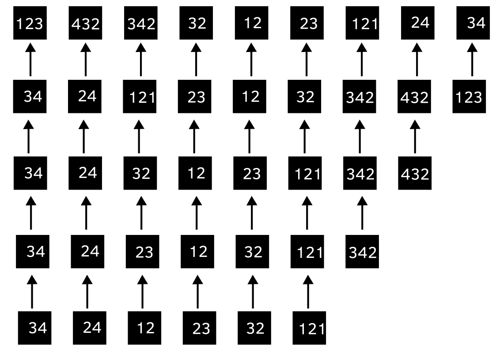
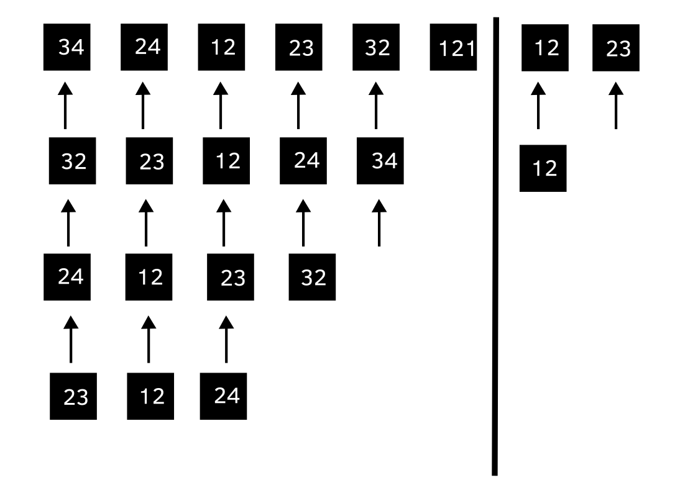
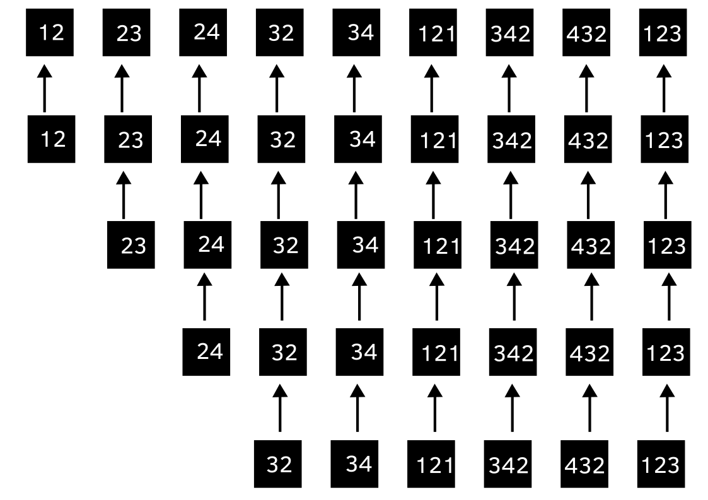
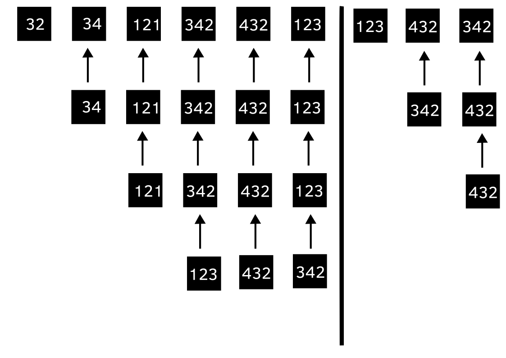
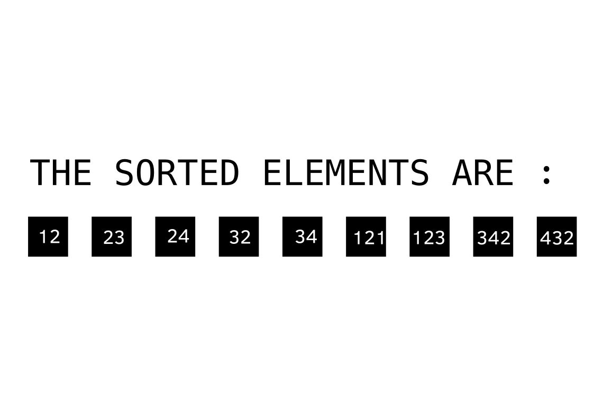
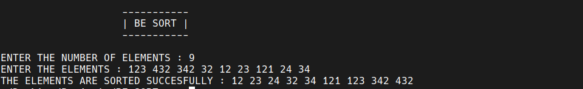

# BE SORT :

`BE SORT` is an sorting algorithm and implemented using C Language.

---

## WHY I CREATED IT ?

When i was studying `quick sort` it blew my mind. I don't know whether this algorithm is already been created but this idea just came to my mind and i implemented it with my favorite tool / programming language C. At first i had a different approch but over the course of implementation of algorithm it changed. I already created another sorting program know as `MAXDELETE SORT` if you haven't seen it check it out [here](https://github.com/dev-shadoww/maxDeleteSort).

---

## HOW IT WORKS ?

It has two stages `IMAGE 1` and `IMAGE 2` explains the first stage while `IMAGE 3` and `IMAGE 4` explains the second stage and finally in `IMAGE 5` we have our sorted list.

At first **i** is pointing to 0 and **j** is pointing two **n - 1** and we start compairing **i**th element with **j**th element if **i**th element is less than the **j**th element then we swap the elements and **i** is incremented by one and **j** is decremented by one and this process continues until all the comparisons are done.Then again **i** points to 0 and **j** remains fixed and the above process is repeated until **i** and **j** becomes equal.You can visualize it in `IMAGE 1` and `IMAGE 2`. This is the first stage.

###### IMAGE 1 :

###### IMAGE 2 :

In second stage at first **i** is pointing to 0 and **j** is pointing two **n - 1** and we start compairing **i**th element with **j**th element if **i**th element is greater than the **j**th element then we swap the elements and **i** is incremented by one and **j** is decremented by one and this process continues until all the comparisons are done. Then again **j** points to **n - 1** and **i** remains fixed and the above process is repeated until **i** and **j** becomes equal.You can visualize it in `IMAGE 3` and `IMAGE 4`.

###### IMAGE 3 :

###### IMAGE 4 :

Finally we get sorted list.

###### IMAGE 5 :

It doesn't use the **i** and **j** values to terminate the loop for that reason it has specific variables. So for more information check out the code.

---

## OUTPUT :

