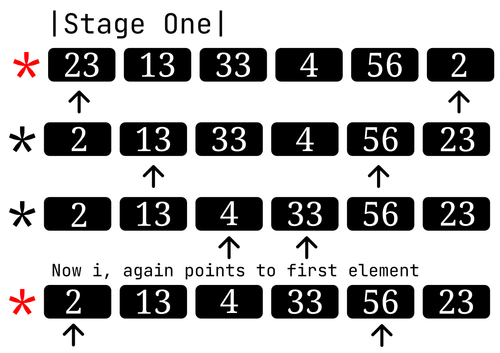
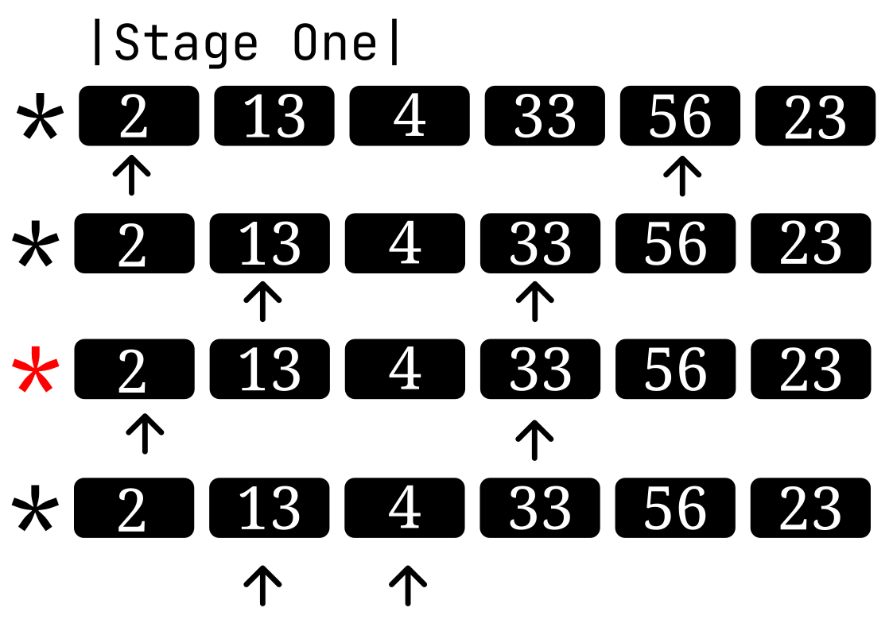
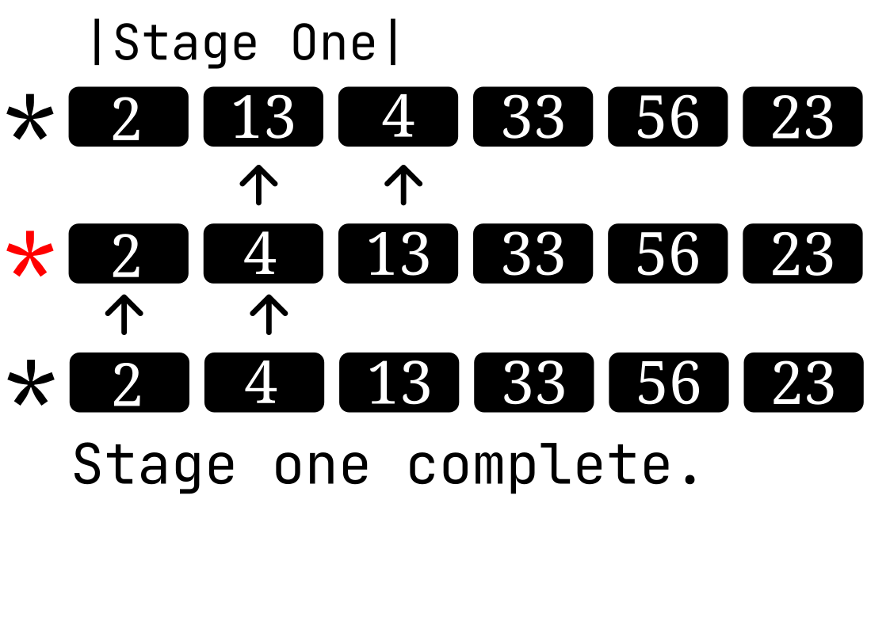
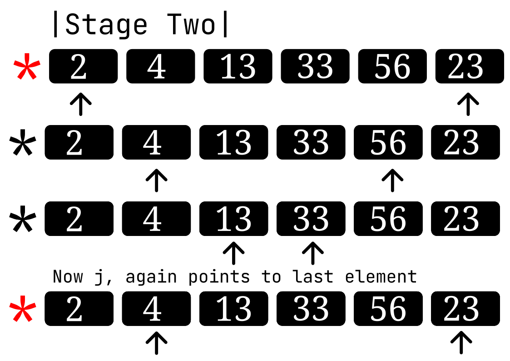
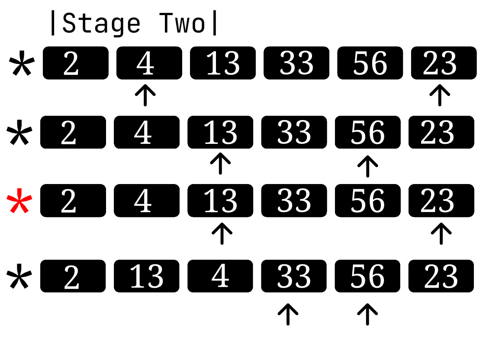
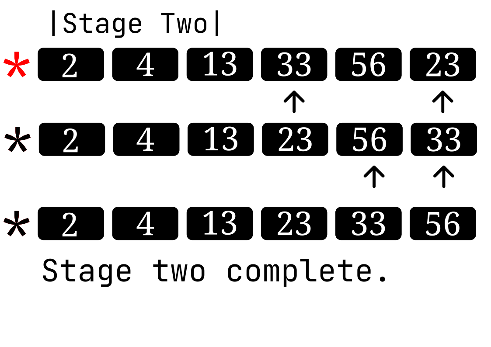
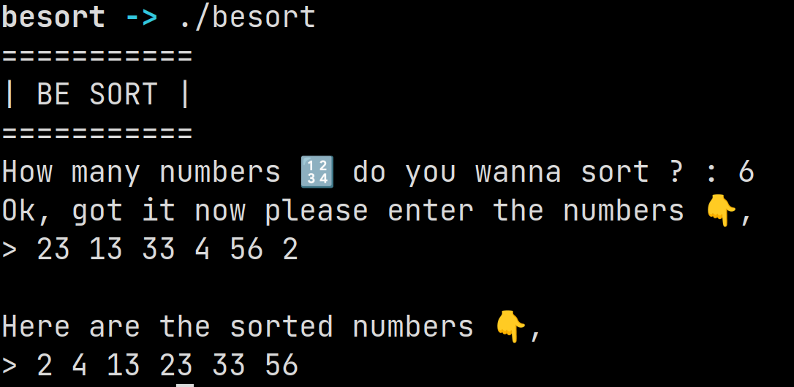

# BE Sort

A sorting algorithm inspired by **quick sort**.This program is created in **C** language.

## How it works ?

There are two pointers (Not actual C pointers, just normal variables) `pointElementI` and `pointElementJ`, it works in two stages, in first stage the `pointElementI` is fixed and in second stage `pointElementJ` is fixed, but in both stages `i` is incremented and `j` is decremented.

To explain this i have created these 👇, the **red** colored star indicates a new stage within the main stage, at this stage `i` again points to it's initial value, but `j` is decremented in first stage and vice versa.

### Stage One

### Stage Two

## Output

